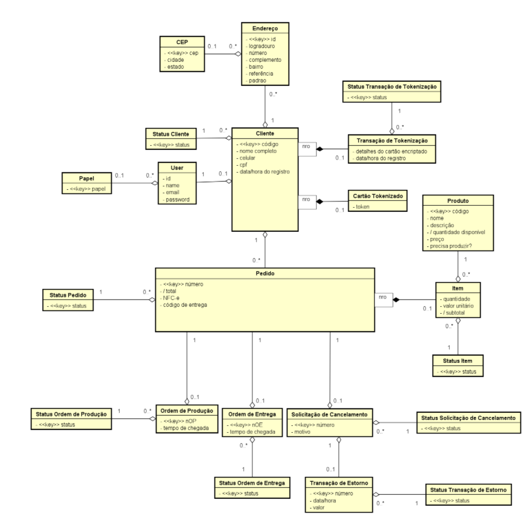

# Sabor Local (SLFood)

Plataforma completa de delivery desenvolvida para permitir que restaurantes operem seu próprio ecossistema digital, reduzindo a dependência de marketplaces de terceiros e fortalecendo o relacionamento direto com seus clientes.

---

# Descrição do Problema

Restaurantes de pequeno e médio porte enfrentam diversos desafios ao utilizar plataformas de delivery terceirizadas:

* Taxas elevadas sobre cada pedido (20% a 30%).
* Pouco controle sobre a experiência do cliente.
* Dificuldade em fidelizar consumidores.
* Acesso limitado aos dados dos clientes.
* Dependência operacional de plataformas externas.

O **Sabor Local (SLFood)** foi desenvolvido para resolver esses problemas através de uma solução própria de delivery, permitindo controle total da operação, maior lucratividade e fortalecimento da marca.

---

# Objetivo da Solução

Criar um ecossistema digital integrado que permita ao restaurante:

* Receber pedidos diretamente.
* Gerenciar entregas.
* Controlar cardápio e estoque.
* Fidelizar clientes.
* Automatizar atendimento.
* Acompanhar indicadores operacionais.
* Processar pagamentos digitais com segurança.

---

# 🏗️ Arquitetura da Solução

## Tecnologias Utilizadas

| Tecnologia      | Finalidade                                              |
| --------------- | ------------------------------------------------------- |
| FlutterFlow     | Desenvolvimento dos aplicativos e painel administrativo |
| Xano            | Backend e banco de dados                                |
| Asaas           | Processamento de pagamentos                             |
| SendGrid        | Envio de e-mails                                        |
| Telegram        | Canal de atendimento                                    |
| n8n             | Automação e Agente de IA                                |

---

## Demonstração do Sistema

## Chat Bot - Telegram

---

## Diagrama Entidade Relacionamento

  

# Componentes do Sistema

## App Cliente

Aplicativo utilizado pelos consumidores para:

* Cadastro e autenticação
* Consulta de cardápio
* Pesquisa de produtos
* Gerenciamento de endereços
* Gerenciamento de cartões
* Realização de pedidos
* Pagamentos digitais
* Rastreamento de entregas
* Programa de fidelidade

---

## Sistema de Gestão Web

Painel administrativo responsável por:

* Gestão de produtos
* Gestão de categorias
* Gestão de pedidos
* Gestão de funcionários
* Controle operacional
* Relatórios financeiros
* Controle de estoque

---

## Agente IA

Assistente virtual responsável por:

* Consultar pedidos
* Responder dúvidas
* Informar status de entrega
* Apresentar promoções
* Auxiliar clientes via Telegram

---

# 🔄 Fluxo Geral da Plataforma

Cliente

⬇️

App Cliente

⬇️

Xano (Backend)

⬇️

Banco de Dados

⬇️

Pagamento

⬇️

Produção

⬇️

Entrega

⬇️

Cliente

---

# Fluxo de Cadastro

Cliente

⬇️

Informa Nome e Telefone

⬇️

Recebe Código de Verificação

⬇️

Informa Código

⬇️

Sistema Valida Código

⬇️

Cadastro Completo Liberado

⬇️

Cliente Define E-mail e Senha

⬇️

Conta Ativada

---

# Fluxo de Recuperação de Senha

Usuário

⬇️

Seleciona "Esqueci Minha Senha"

⬇️

Informa E-mail ou Telefone

⬇️

Sistema Gera Código

⬇️

Código É Enviado

⬇️

Usuário Informa Código

⬇️

Sistema Valida

⬇️

Nova Senha Definida

⬇️

Senha Atualizada

---

# Fluxo de Pesquisa de Produtos

Usuário

⬇️

Digita Nome do Produto

⬇️

Sistema Consulta Catálogo

⬇️

Produtos Compatíveis Encontrados

⬇️

Resultados Exibidos

⬇️

Usuário Seleciona Produto

---

# Gerenciamento de Endereços

O sistema permite múltiplos endereços por usuário.

## Regras de Negócio

* Um usuário pode possuir vários endereços.
* Deve existir pelo menos um endereço cadastrado.
* Apenas um endereço pode ser marcado como padrão.
* Ao definir um novo endereço padrão, o anterior perde automaticamente esta condição.
* Endereços podem ser editados.
* Endereços podem ser removidos.

## Fluxo

Usuário

⬇️

Adicionar Endereço

⬇️

Informar CEP

⬇️

Informar Complementos

⬇️

Validação

⬇️

Endereço Salvo

---

# Gerenciamento de Cartões

O sistema utiliza tokenização para armazenamento seguro.

## Regras de Negócio

* Um usuário pode possuir múltiplos cartões.
* Apenas tokens são armazenados.
* Dados completos do cartão nunca são persistidos.
* Cartões podem ser removidos.
* Um cartão pode ser definido como preferencial.

## Fluxo

Usuário

⬇️

Adicionar Cartão

⬇️

Gateway Realiza Tokenização

⬇️

Token Retornado

⬇️

Token Armazenado

⬇️

Cartão Disponível para Uso

---

# Fluxo do Carrinho

Cliente

⬇️

Seleciona Produto

⬇️

Produto Adicionado ao Carrinho

⬇️

Sistema Atualiza Pedido

⬇️

Sistema Calcula Totais

⬇️

Cliente Prossegue para Checkout

---

# Fluxo do Pedido

Cliente

⬇️

Seleciona Produtos

⬇️

Adiciona ao Carrinho

⬇️

Seleciona Endereço

⬇️

Seleciona Forma de Pagamento

⬇️

Confirma Pedido

⬇️

Pedido Criado

⬇️

Validação de Estoque

⬇️

Processamento do Pagamento

⬇️

Pedido Pago

⬇️

Ordem de Produção Gerada

---

# Fluxo de Pagamento

## Pix

Pedido

⬇️

Gerar QR Code

⬇️

Cliente Efetua Pagamento

⬇️

Gateway Confirma Transação

⬇️

Pedido Atualizado para Pago

---

## Cartão

Pedido

⬇️

Selecionar Cartão

⬇️

Enviar Token ao Gateway

⬇️

Validação da Transação

⬇️

Pagamento Aprovado

⬇️

Pedido Atualizado para Pago

---

# Fluxo de Produção

Pedido Pago

⬇️

Ordem de Produção Criada

⬇️

Cozinha Recebe Pedido

⬇️

Preparação dos Itens

⬇️

Conferência

⬇️

Pedido Liberado para Entrega

---

---

# 📊 Status do Pedido

| Status               |
| -------------------- |
| Criado               |
| Aguardando Pagamento |
| Pago                 |
| Em Produção          |
| Em Separação         |
| Saiu para Entrega    |
| Entregue             |
| Cancelado            |

---

# 🗄️ Estrutura de Dados

## Principais Entidades

### Usuário

* id
* email
* senha
* authToken
* papel_id

### Cliente

* nome
* cpf
* celular
* status

### Endereço

* cliente_id
* cep
* logradouro
* numero
* bairro
* endereco_padrao

### Produto

* nome
* descricao
* preco
* qtd_disp
* precisa_produzir

### Pedido

* cliente_id
* total
* status
* codigo_entrega

### ItemPedido

* pedido_id
* produto_id
* quantidade
* subtotal

### CartaoTokenizado

* token
* bandeira
* ultimos_4_digitos

---

# 🔒 Segurança

## Controles Implementados

| Controle              | Implementação  |
| --------------------- | -------------- |
| Autenticação          | AuthToken Xano |
| Controle de Acesso    | RBAC           |
| Criptografia          | AES-256        |
| Tokenização           | PCI DSS        |
| Comunicação Segura    | TLS/SSL        |
| Validação de Cadastro | E-mail         |

## Perfis

### Administrador

* Gestão total da plataforma

### Atendente

* Gestão operacional dos pedidos

### Cozinheiro

* Produção

### Entregador

* Logística

### Cliente

* Consumo da plataforma

---

# 🔌 Integrações Externas

| Serviço      | Finalidade           |
| ------------ | -------------------- |
| Asaas        | Pagamentos           |
| SendGrid     | E-mails              |
| Telegram     | Atendimento          |
| n8n          | IA e automações      |

---

# 🏁 Resultado Esperado

O SLFood busca proporcionar independência operacional ao restaurante, reduzir custos com intermediários, melhorar a experiência do cliente e aumentar a lucratividade através de uma plataforma própria, escalável e integrada.
